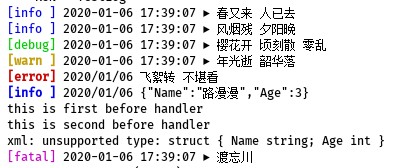

# logger
日志打印工具

### 当前版本

- v3.0.0

##### 颜色控制

- 代码

```go
func TestColor(t *testing.T){
	fmt.Println(logger.Blue("春又来 人已去"))
	fmt.Println(logger.Red("风烟残 夕阳晚"))
	fmt.Println(logger.Yellowf("%s","樱花开 顷刻散 零乱"))
	// 设置颜色模式:  0 - 没有颜色; 1 - 颜色(默认) ; 2 - 高亮 ; 3 - 反显
	logger.SetMode(2)
	fmt.Println(logger.Green("年光逝 韶华落"))
	logger.SetMode(3)
	fmt.Println(logger.White("飞絮转 不堪看"))
	logger.SetMode(0)
	fmt.Println(logger.Magenta("路漫漫 空梦断 零乱"))
	// 新建一个
	color := logger.NewColor()
	fmt.Println(color.Cyan("渡忘川 彼岸 忘不掉 人常叹 古井下 月光思念装满 樱花瓣 飞过 风幽怨 水清叹 离伤黯 游丝转 零乱"))
}
```

- 预览


##### 日志器

```go
func TestLog(t *testing.T){
	logger.Infoln("春又来 人已去")
	logger.Infof("%s %s","风烟残","夕阳晚")
	// 设置日志等级: debug info warn error fatal
	logger.SetLevel("debug")
	logger.Debugln("樱花开 顷刻散 零乱")
	// 设置颜色高亮
	logger.SetColorMode(2)
	logger.Warnln("年光逝 韶华落")
	// 设置日期格式
	logger.SetTimeFormat("2006/01/02 ")
	logger.Errorln("飞絮转 不堪看")
	// 设置内容格式化: TEXT JSON JSON_INDENT XML  XML_INDENT YAML,可以自定义
	logger.SetFormatter(logger.JSON)
	a := struct {
		Name string
		Age  int
	}{
		Name: "路漫漫",
		Age: 3,
	}
	logger.Infoln(a)
	logger.SetFormatter(logger.XML)
	// 添加前置处理器,日志打印前处理
	logger.AddBefore(func(ctx *logger.Ctx) {
		fmt.Println("this is first before handler")
	})
	logger.AddBefore(func(ctx *logger.Ctx) {
		fmt.Println("this is second before handler")
		ctx.Stop()  // 后面的前置处理器将不会执行
	})
	// 这个不会打印，因为在前一个处理器时已经stop了
	logger.AddBefore(func(ctx *logger.Ctx) {
		fmt.Println("this is third before handler")
	})
	// 添加后置处理器,日志打印后处理
	logger.AddAfter(func(ctx *logger.Ctx) {
		if ctx.Err != nil{
			fmt.Println(ctx.Err.Error())
		}
	})
	// 这个不会打印，因为xml不支持这个类型,错误会被上面的后置处理器打印出来
	logger.Infoln(&a)

	// 新建一个日志器
	lg := logger.New()
	// 设置输出流
	lg.SetOutput(os.Stderr)
	entry := logger.NewEntry(lg)
	entry.Fatalln("渡忘川")
}
```

- 预览

