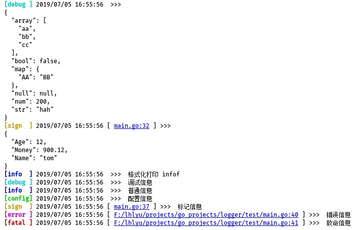
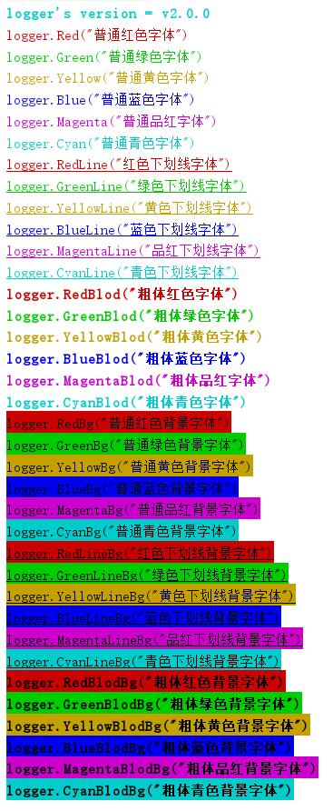

# logger
日志打印工具

### 当前版本

- v2.0.0

### 安装

> set GOPROXY=https://goproxy.io
 
> go get github.com/lhlyu/logger

### 日志等级

```
None     无          5
Fatal    致命信息    4    会退出程序
Error    错误信息    3  
Warn     警告信息    2
Info     普通信息    1
Debug    调试信息    0
```

### 使用 

- 例子

```go
package main

import "github.com/lhlyu/logger"

type A struct {
	B int
	C D
}

type D struct {
	E string
	F int
}

func main() {
	logger.Reset()
	logger.SetTimeFormat("2006-01-02 15.04.05")
	logger.SetLevel(logger.LevelDebug)
	logger.PNone("--> logger.PNone")
	logger.PWarn("--> logger.PWarn")
	logger.SetColorMod(false) // 关闭颜色打印
	logger.PDebug("--> logger.PDebug")
	logger.SetColorMod(true) // 开启颜色打印
	logger.SetDelims("<<<<", ">>>>")
	logger.PDebugf("--> %s", "logger.PDebugf")
	logger.SetLocation(1) // 打印调用方法的位置
	logger.PInfo("--> logger.PInfo")
	logger.SetLocation(2) // 打印调用文件的位置
	logger.PErrorf("--> %s", "logger.PErrorf")
	logger.Reset() // 重置
	logger.PDebug("--> 这个不会输出，因为重置后日志等级默认是1,调试信息的等级是0")
	logger.PWarnf("--> %s", "logger.PWarnf")
	//logger.PJson(A{1, D{"logger.PJson", 2}}) // 格式化打印对象
	logger.PJsonL(logger.LevelError, A{1, D{"logger.PJsonL", 2}})
	logger.PNormal("--> logger.PNormal")
	logger.PFatal("--> logger.PFatal") // 打印致命信息会导致程序退出，后面的程序不会再执行
	logger.PInfo("--> 这个不会输出")
}
```


### 其他方法

```
func Reset()                                   // 重置,回归初始
func SetWriters(writers ...io.Writer)          // 设置输出端
func SetTimeFormat(s string)                   // 设置时间格式
func SetFilePath(s string)                     // 设置文件路径
func SetLevel(level int)                       // 设置日志等级
func SetColorMod(enable bool)                  // 设置是否启用颜色打印
func SetDelims(left,right string)              // 设置日志左右标签 默认是 [  和  ]
func SetLocation(location int)                 // 设置日志打印文件和行号  0 - 不打印(默认)  1- 打印调用方法名和行号
  2-打印文件路径和行号
func PNone(v ...interface{})                   // 无前缀打印信息
func PFatal(v ...interface{})                  // 打印致命信息，会退出程序
func PError(v ...interface{})                  // 打印错误信息
func PWarn(v ...interface{})                   // 打印警告信息
func PInfo(v ...interface{})                   // 打印普通信息
func PDebug(v ...interface{})                  // 打印调试信息

func PNonef(format string,v ...interface{})    // 格式化打印无前缀信息
func PFatalf(format string,v ...interface{})   // 格式化打印致命信息，会退出程序
func PErrorf(format string,v ...interface{})   // 格式化打印错误信息
func PWarnf(format string,v ...interface{})    // 格式化打印警告信息
func PInfof(format string,v ...interface{})    // 格式化打印普通信息
func PDebugf(format string,v ...interface{})   // 格式化打印调试信息

func PJson(v interface{})                      // 打印一个对象
func PJsonL(level int,v interface{})           // 自定义等级，打印一个对象

func PNormal(v ...interface{})                 // 一个普通打印
func PNormalf(format string,v ...interface{})  // 一个普通格式化打印
```

### 字体样式

- 例子

```go
package main

import "fmt"
import "github.com/lhlyu/logger"

func main(){
    fmt.Println(logger.Red(`logger.Red("普通红色字体")`))
    fmt.Println(logger.Green(`logger.Green("普通绿色字体")`))
    fmt.Println(logger.Yellow(`logger.Yellow("普通黄色字体")`))
    fmt.Println(logger.Blue(`logger.Blue("普通蓝色字体")`))
    fmt.Println(logger.Magenta(`logger.Magenta("普通品红字体")`))
    fmt.Println(logger.Cyan(`logger.Cyan("普通青色字体")`))
    fmt.Println(logger.RedLine(`logger.RedLine("红色下划线字体")`))
    fmt.Println(logger.GreenLine(`logger.GreenLine("绿色下划线字体")`))
    fmt.Println(logger.YellowLine(`logger.YellowLine("黄色下划线字体")`))
    fmt.Println(logger.BlueLine(`logger.BlueLine("蓝色下划线字体")`))
    fmt.Println(logger.MagentaLine(`logger.MagentaLine("品红下划线字体")`))
    fmt.Println(logger.CyanLine(`logger.CyanLine("青色下划线字体")`))
    fmt.Println(logger.RedBlod(`logger.RedBlod("粗体红色字体")`))
    fmt.Println(logger.GreenBlod(`logger.GreenBlod("粗体绿色字体")`))
    fmt.Println(logger.YellowBlod(`logger.YellowBlod("粗体黄色字体")`))
    fmt.Println(logger.BlueBlod(`logger.BlueBlod("粗体蓝色字体")`))
    fmt.Println(logger.MagentaBlod(`logger.MagentaBlod("粗体品红字体")`))
    fmt.Println(logger.CyanBlod(`logger.CyanBlod("粗体青色字体")`))
    fmt.Println(logger.RedBg(`logger.RedBg("普通红色背景字体")`))
    fmt.Println(logger.GreenBg(`logger.GreenBg("普通绿色背景字体")`))
    fmt.Println(logger.YellowBg(`logger.YellowBg("普通黄色背景字体")`))
    fmt.Println(logger.BlueBg(`logger.BlueBg("普通蓝色背景字体")`))
    fmt.Println(logger.MagentaBg(`logger.MagentaBg("普通品红背景字体")`))
    fmt.Println(logger.CyanBg(`logger.CyanBg("普通青色背景字体")`))
    fmt.Println(logger.RedLineBg(`logger.RedLineBg("红色下划线背景字体")`))
    fmt.Println(logger.GreenLineBg(`logger.GreenLineBg("绿色下划线背景字体")`))
    fmt.Println(logger.YellowLineBg(`logger.YellowLineBg("黄色下划线背景字体")`))
    fmt.Println(logger.BlueLineBg(`logger.BlueLineBg("蓝色下划线背景字体")`))
    fmt.Println(logger.MagentaLineBg(`logger.MagentaLineBg("品红下划线背景字体")`))
    fmt.Println(logger.CyanLineBg(`logger.CyanLineBg("青色下划线背景字体")`))
    fmt.Println(logger.RedBlodBg(`logger.RedBlodBg("粗体红色背景字体")`))
    fmt.Println(logger.GreenBlodBg(`logger.GreenBlodBg("粗体绿色背景字体")`))
    fmt.Println(logger.YellowBlodBg(`logger.YellowBlodBg("粗体黄色背景字体")`))
    fmt.Println(logger.BlueBlodBg(`logger.BlueBlodBg("粗体蓝色背景字体")`))
    fmt.Println(logger.MagentaBlodBg(`logger.MagentaBlodBg("粗体品红背景字体")`))
    fmt.Println(logger.CyanBlodBg(`logger.CyanBlodBg("粗体青色背景字体")`))
}
```

- 预览



- 方法

```go
logger.Red("普通红色字体")
logger.Green("普通绿色字体")
logger.Yellow("普通黄色字体")
logger.Blue("普通蓝色字体")
logger.Magenta("普通品红字体")
logger.Cyan("普通青色字体")
logger.RedLine("红色下划线字体")
logger.GreenLine("绿色下划线字体")
logger.YellowLine("黄色下划线字体")
logger.BlueLine("蓝色下划线字体")
logger.MagentaLine("品红下划线字体")
logger.CyanLine("青色下划线字体")
logger.RedBlod("粗体红色字体")
logger.GreenBlod("粗体绿色字体")
logger.YellowBlod("粗体黄色字体")
logger.BlueBlod("粗体蓝色字体")
logger.MagentaBlod("粗体品红字体")
logger.CyanBlod("粗体青色字体")
logger.RedBg("普通红色背景字体")
logger.GreenBg("普通绿色背景字体")
logger.YellowBg("普通黄色背景字体")
logger.BlueBg("普通蓝色背景字体")
logger.MagentaBg("普通品红背景字体")
logger.CyanBg("普通青色背景字体")
logger.RedLineBg("红色下划线背景字体")
logger.GreenLineBg("绿色下划线背景字体")
logger.YellowLineBg("黄色下划线背景字体")
logger.BlueLineBg("蓝色下划线背景字体")
logger.MagentaLineBg("品红下划线背景字体")
logger.CyanLineBg("青色下划线背景字体")
logger.RedBlodBg("粗体红色背景字体")
logger.GreenBlodBg("粗体绿色背景字体")
logger.YellowBlodBg("粗体黄色背景字体")
logger.BlueBlodBg("粗体蓝色背景字体")
logger.MagentaBlodBg("粗体品红背景字体")
logger.CyanBlodBg("粗体青色背景字体")
```