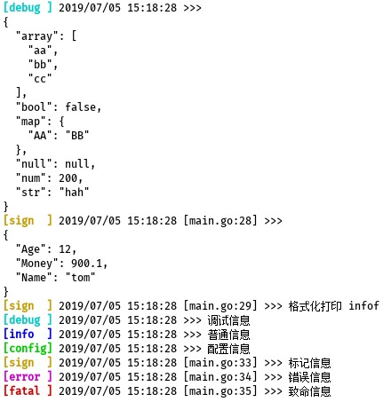

# logger
日志打印工具

### 当前版本

- v1.1.3

### 安装

> go get github.com/lhlyu/logger

### 日志等级

```
DEBUG   调试信息   0   不会打印文件和行号    默认等级
INFO    普通信息   1   不会打印文件和行号
CONFIG  配置信息   2   不会打印文件和行号
SIGN    标记信息   3   会打印文件和行号
ERROR   错误信息   4   会打印文件和行号  
FATAL   致命信息   5   会打印文件和行号并且退出程序
```

### 使用 

- 例子

```go
import (
	"github.com/lhlyu/logger"
)

type Demo struct {
	Name string
	Age  int
	Money float64
}

func main(){
	v := map[string]interface{}{
		"str": "hah",
		"num": 200,
		"bool": false,
		"null": nil,
		"array": []string{"aa", "bb", "cc"},
		"map": map[string]interface{}{
			"AA": "BB",
		},
	}
	// 自定义等级，格式化打印一个map
	logger.Json(logger.LV_DEBUG,v)
	demo := Demo{"tom",12,900.10}
	// 标记信息，格式化打印一个struct
	logger.JsonSign(demo)
	logger.Infof("格式化打印 %s","infof")
	logger.Debug("调试信息")
	logger.Info("普通信息")
	logger.Config("配置信息")
	logger.Sign("标记信息")
	logger.Error("错误信息")
	logger.Fatal("致命信息")
}
```


### 其他方法
```
logger.XXXX(v ...interface{})                         // 打印
logger.XXXXf(format string,v ...interface{})          // 格式化打印
logger.Print(lv int,v ...interface{})                 // 自定义等级
logger.Printf(lv int,format string,v ...interface{})  // 自定义等级格式化
logger.Json(lv int,v interface{})                     // 自定义等级格式化打印对象
logger.JsonSign(v interface{})                        // 标记信息等级格式化打印对象
 
logger.NewLogger(lv int, fldir string) *Logger        // New
logger.SetLogger(logger *Logger)                      // 设置自己的日志管理器
logger.SetColor(open int)                             // 设置颜色打印，默认(open=0)是开启
logger.SetLevel(level int)                            // 设置日志等级，默认是 0 
logger.SetAbs(abs int)                                // 设置打印文件位置是否使用绝对路径，默认0，不使用 
```


### 注意

- 有的终端是不支持色彩打印的，所以如果需要设置不打印色彩提示，可以取消色彩
- 文本日志是默认不开启色彩

```go
logger.SetColor(1)  // 关闭色彩
logger.SetColor(0)  // 开启色彩，这是默认设置
```

- 如果go mod下载不了依赖 golang.org/x/sys，请在go.mod文件下加上这句
```
replace golang.org/x/sys => github.com/golang/sys latest
```

### 参考

1. [https://github.com/fatih/color](https://github.com/fatih/color)
2. [https://github.com/mattn/go-isatty](https://github.com/mattn/go-isatty)
3. [github.com/hokaccha/go-prettyjson](github.com/hokaccha/go-prettyjson)